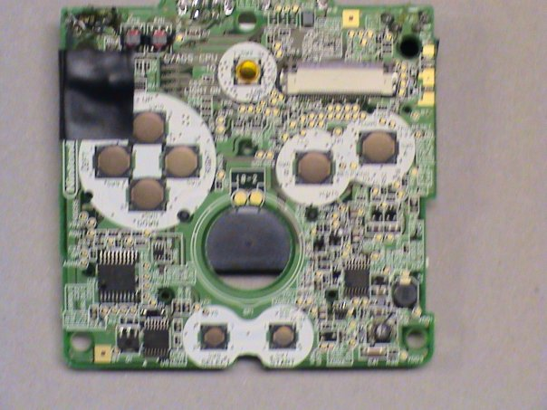

# [Gameboy Calculator](gameboy-calculator.md)

I modified the case of a TI-84+ to house the innards of a Gameboy Advance SP. The Gameboy's screen is approximately the same size as the calculator's, so it was a good fit. The game cartridge could be exchanged through the battery cover on the back. I later wired the Gameboy's buttons to the calculator's (not shown in these pictures).

