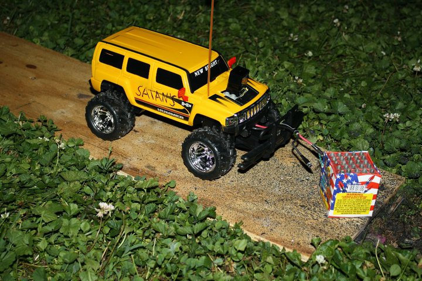
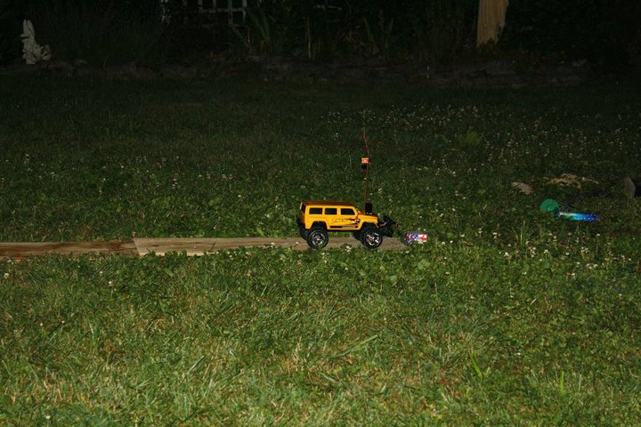
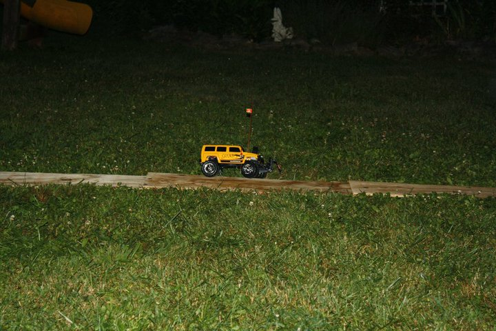
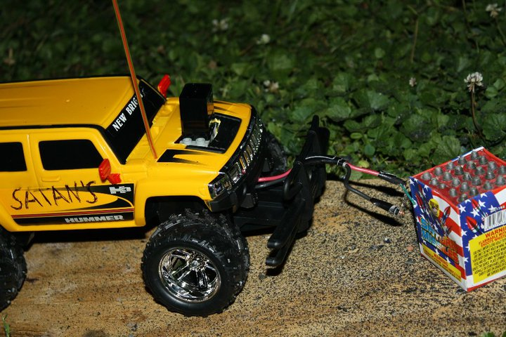
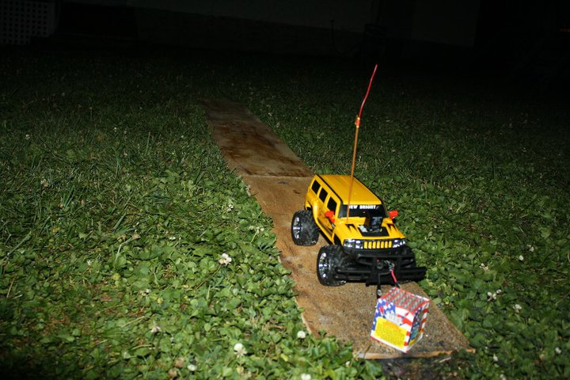
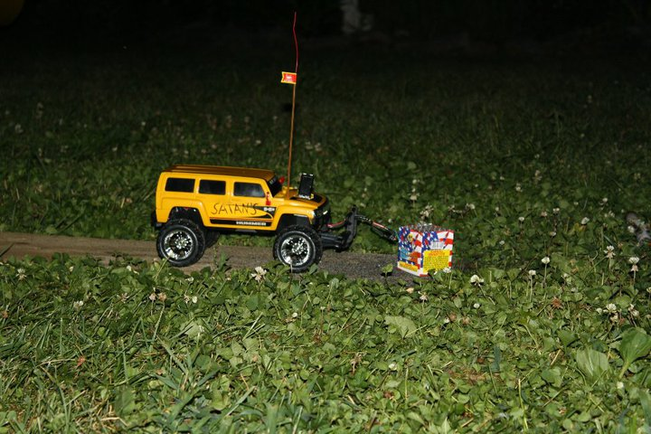

# [Satan's Hummer](satans-hummer.md)

I used an RC car to light fireworks remotely one year for the 4th of July. I mounted a bank of 9v batteries on the car and wired them to a hair dryer coil through a relay. When the steering controls were activated, the relay would engage, which would supply enough current to the hair dryer coil to ignite the fireworks fuse. The car could then be driven away to safety.

