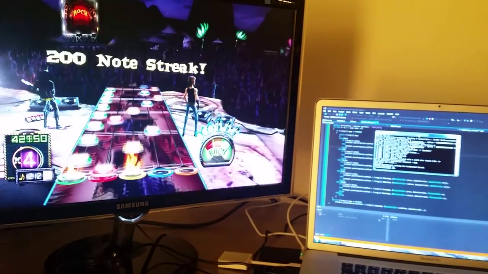

# [Xbot](xbot.md)

The goal of this ongoing project has been to automate console games. Inspired by [this project](http://procrastineering.blogspot.com/2010/12/simulated-ps2-controller-for.html), I used a Teensy microcontroller to emulate the PS2 controller protocol. This allows my computer to send button press commands to the console over a serial port.

Eventually, I rewrote the PS2 driver firmware to eliminate some bugs and facilitate more tightly scheduled commands. For games that are very timing-sensitive (or which require fast response time), it was critical to allow my computer to schedule the button presses as precisely as possible.

[Code here](https://github.com/CalculatorSP/xbot2014)

Here are the games I've worked on so far:

### Chessmaster Live

Using the Stockfish API, I created a bot that could play chess against the computer. Implementing the actual "decision making" part was straightforward with Stockfish - chooshing the next move is as simple as making an API call. The tricky part was detecting what move had been made by the opponent. For this, I used OpenCV to analyze video data of the 2D chess board. The algorithm waited for a move to be made, and then decided which squares had been involved in the move by determining which squares exhibited the greatest change in color over the course of the move. It then cross-referenced a list of currently legal moves from Stockfish to estimate which move the opponent most likely made.

### Guitar Hero III

In order to get the best performance in Guitar Hero, I decided to forgo video processing and instead use a preprogrammed "note chart" to directly tell the computer the timing of each button press. The open-source game [Frets on Fire](http://fretsonfire.sourceforge.net/) contains all of the songs in Guitar Hero III, with exactly the same button sequences. I was therefore able to extract "note charts" from the Frets on Fire songs and use them to automate Guitar Hero.

To detect the start of the song, the bot uses an audio cue. There is a "thump" sound that the game plays exactly as the song starts - when the bot detects that (using PortAudio), it begins executing the note chart sequence.

[Here's a video](https://www.youtube.com/watch?v=VtDMKWXlOP4) of the bot playing Through the Fire and Flames on Expert.

### Halo 4

